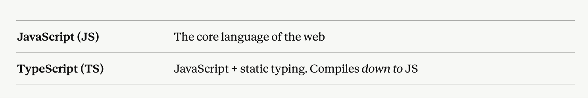
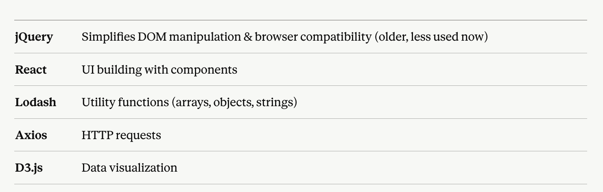
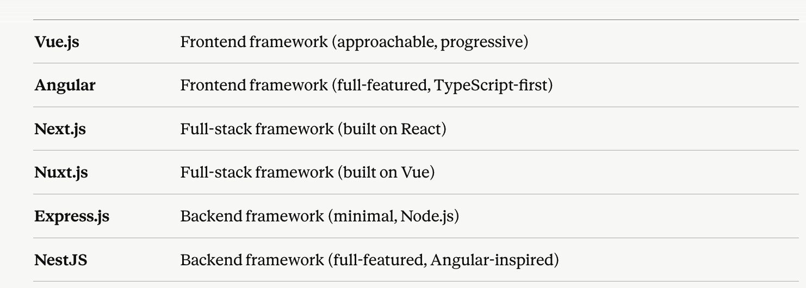
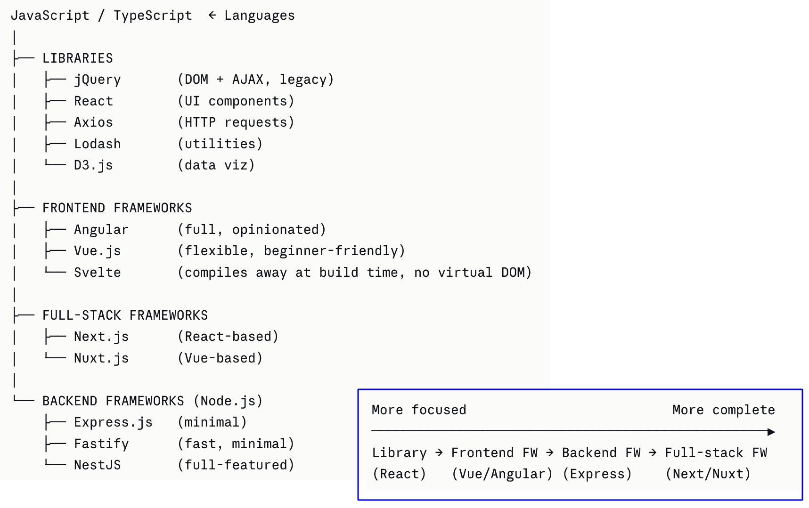

[Back to README](./README.md)

Regarding to web development, very often, the terms are confusing and used incorrectly. 
Some are languages, some are frameworks and some are libraries. 

Language is the actual thing the browser/server understands. Everything else is built on top of it. E.g. JavaScript, TypeScript, VBScript.

Library is a collection of pre-written code to call when needed to use the provided functionality. 

Framework provides a complete structure, for frontend development, backend, or full-stack. 
Some examples are provided.

​Examples for languages:

​Examples for Libraries:

​Examples for Frameworks:

Full visual map can be depicted as follows:

For more-focused insight on **Library vs Framework**:  

[Back to README](./README.md)