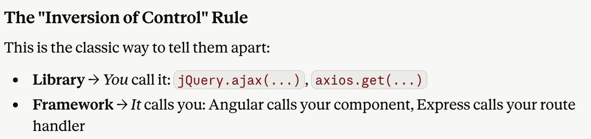
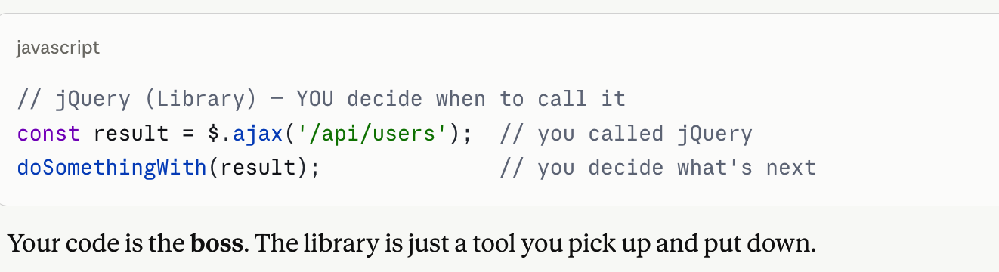
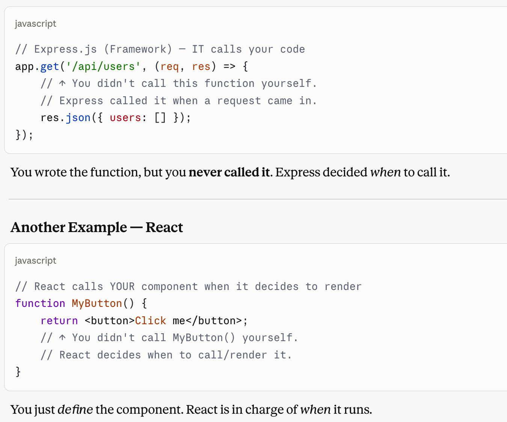
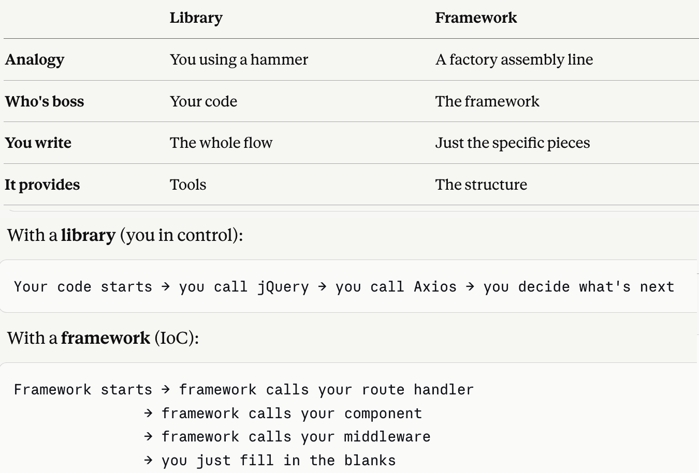

[Back to README](./README.md)

### JavaScript Library Vs Framework

The difference between the libraries and frameworks can be perceived from different angles.
You call the library. It doesn't control your app.
The framework controls the structure. You fill in the pieces.

The framework is like a skeleton — it has the shape already, you just add the flesh. That leads to the idea of IoC (Inversion of Control).

The idea is briefed as follows:

Going slightly further into details:

Therefore, they can be compared as follows:

The confusing part is that the line between library and framework can blur — React calls itself a library but many treat it like a framework, especially with Next.js on top. So don't stress too much about the label — focus on what problem each tool solves.

[Back to JavaScript](./JavaScript.md)
[Back to README](./README.md)