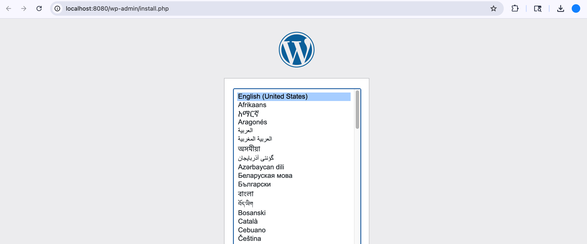
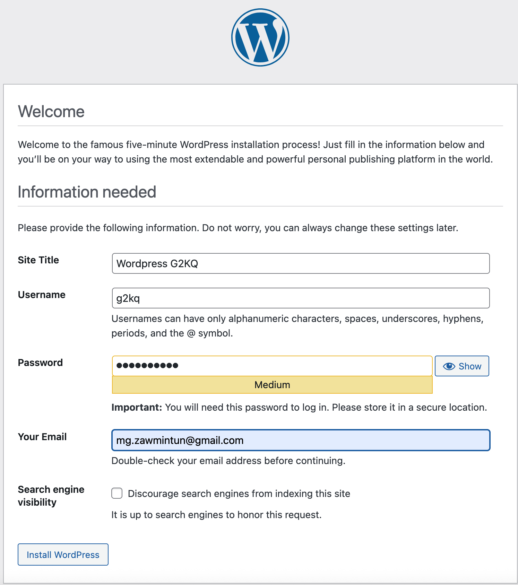
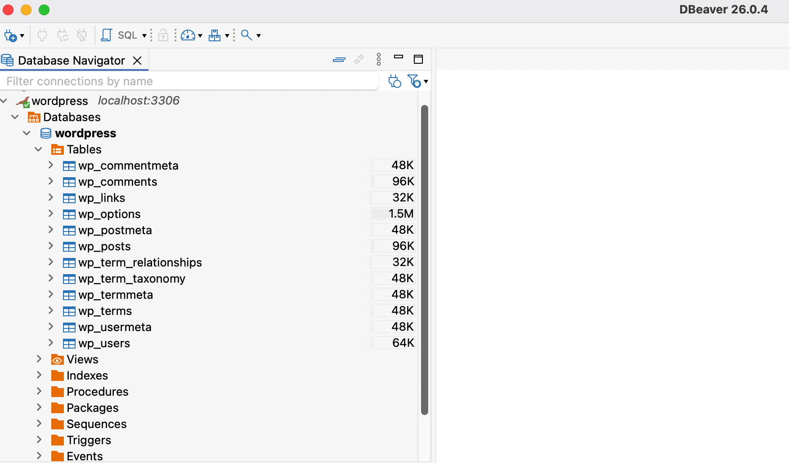

## Getting to know quickly: Wordpress

### 1. Prerequisites
1. Docker is readily installed.

### 2. Building the containers and bringing up the system
1. Create a file called ".env" — follow the sample env.example file's contents.
2. Run docker command:

   `docker compose up -d`

   `-d` flag is to run in detached mode. If it is preferable to have it running showing the logs and interruptible, don't use the flag.

   Containers should be up and running as shown in the picture. Names can be different as per environment.

   

### 3. Verifying Wordpress
1. Go to: http://localhost:8080/

   Since this is the first time running, the Wordpress installation page will show up.

   

2. Provide the necessary information as required.

   

3. After that you should be able to log in to Wordpress as an admin by using the username and password that you provided.
4. Without doing any action in the admin space, you should be able to go and visit: http://localhost:8080/, and this time, the website that you set up in Step 2 should show up.
5. You can proceed with trying around the Wordpress features in the admin space, e.g. installing themes, enable a theme, installing plugins, etc.

### 4. Verifying Database
1. Any database frontend will be required. Here, DBeaver is used.
2. By providing the information which is set in Step 2.1, you should be able to connect to the database. In this example (docker compose), MariaDB is used, so the connection setup should choose accordingly.

   
