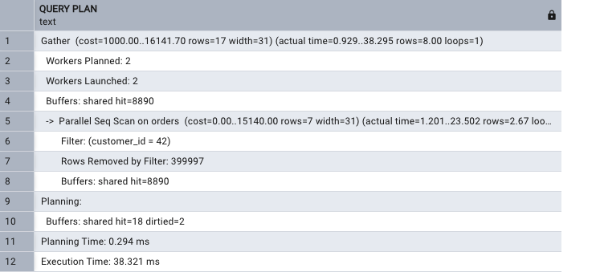
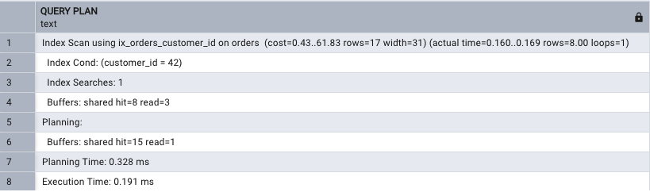

## Database
### Indexing Demo: `EXPLAIN (ANALYZE, BUFFERS)` in pgAdmin

#### [Back to Database contents](../_Contents.md)

- Hands-on experiments for [Indexing](Indexing.md).
- Everything goes into a sandbox schema, **`lab`**, so other tables aren't touched. Step 3 deletes it.
- **Guess the plan before each experiment.** That's the quickest way to learn to read plans.
- Your numbers will differ (random data, different machine), but the **plan shapes** should match.

### pgAdmin tips

- Open **Tools → Query Tool** on any database.
- **F5** runs the whole editor. **Highlight** some text first and F5 runs only that, which lets you run one experiment at a time.
- `EXPLAIN` output appears in **Data Output** as rows of text under a `QUERY PLAN` column.
- **Graphical plan:** the *Explain Analyze* toolbar button (or **Shift+F7**). Its dropdown has options like *Buffers*.
  - Try both views, but the **text** version is what you'll see in forums and documentation.

### Step 1: Create the test data

Run once. It takes a few seconds.

```sql
-- Sandbox schema
CREATE SCHEMA IF NOT EXISTS lab;

-- 100,000 customers
CREATE TABLE lab.customers (
    customer_id  int PRIMARY KEY,
    name         text NOT NULL,
    email        text NOT NULL,
    city         text NOT NULL
);

INSERT INTO lab.customers (customer_id, name, email, city)
SELECT g,
       'Customer ' || g,
       'user' || g || '@example.com',
       (ARRAY['London','Paris','Berlin','Madrid','Rome'])[1 + (g % 5)]
FROM generate_series(1, 100000) AS g;

-- 1,000,000 orders, spread randomly across customers
CREATE TABLE lab.orders (
    order_id     bigint GENERATED ALWAYS AS IDENTITY PRIMARY KEY,
    customer_id  int NOT NULL REFERENCES lab.customers(customer_id),
    status       text NOT NULL,
    total        numeric(10,2) NOT NULL,
    created_at   timestamptz NOT NULL
);

INSERT INTO lab.orders (customer_id, status, total, created_at)
SELECT 1 + floor(random() * 100000)::int,
       CASE WHEN random() < 0.95 THEN 'paid' ELSE 'unpaid' END,
       round((random() * 200)::numeric, 2),
       now() - random() * interval '730 days'
FROM generate_series(1, 1000000);

-- One "huge corporate client" with 200,000 orders (to show skewed data)
INSERT INTO lab.orders (customer_id, status, total, created_at)
SELECT 1, 'paid', round((random() * 200)::numeric, 2), now() - random() * interval '730 days'
FROM generate_series(1, 200000);
```

Then **highlight and run this line on its own**. `VACUUM` can't run together with other statements in one execution.

```sql
VACUUM ANALYZE lab.customers, lab.orders;
```

- **`ANALYZE`** refreshes the **statistics** the planner uses.
- **`VACUUM`** updates the *visibility map*, which lets Experiment 4 (*Index Only Scan*) skip the table.
- It returns **no rows**. pgAdmin only shows *"Query returned successfully in … msec"*, meaning it finished and how long it took. The work happens inside the table.

#### What VACUUM is for

It comes from how PostgreSQL handles changes, a design called **MVCC** (Multi-Version Concurrency Control):
- **`UPDATE`** writes a **new version** of the row and marks the old one as expired.
- **`DELETE`** only **marks** the row as expired. It stays on the page.
- **Why:** transactions that started earlier may still need the **old** version, so **readers never block writers** and writers never block readers.
- **Side effect:** expired rows (**dead tuples**) build up. They take space in the table **and** every index, slow down scans and cause **bloat**.

```
After: UPDATE orders SET total = 50 WHERE order_id = 7;

Page 18233
┌───────────────────────────────────────────┐
│ order_id=7, total=40   ✗ dead (old version)│  ← still taking up space
│ order_id=8, total=12   ✓ live              │
│ order_id=7, total=50   ✓ live (new version)│
└───────────────────────────────────────────┘
```

| VACUUM job | What it means |
|---|---|
| **1. Reclaims dead rows** | Marks their space (in the table and its indexes) as **reusable** |
| **2. Updates the visibility map** | Records pages where **all** rows are visible to everyone, so an **Index Only Scan** can skip the table |
| **3. Freezes old rows** | Prevents **transaction ID wraparound**: the transaction counter is finite, so old rows must be marked "frozen" |

| Command | Purpose |
|---|---|
| `VACUUM` | Cleans up dead rows and updates the visibility map (**storage**) |
| `ANALYZE` | Updates **statistics** for the planner (**row estimates**) |
| `VACUUM ANALYZE` | Both in one go |

- Plain `VACUUM` makes space **reusable** but usually **doesn't shrink the file**.
- **`VACUUM FULL`** rewrites the table to shrink it, but **locks it completely** while it runs, so avoid it on busy production tables.
- **Normally automatic:** the **autovacuum** background process runs it once enough rows have changed.
- **Run it manually** after bulk loads or bulk changes (like this setup) or when learning. If autovacuum can't keep up, **tune** it rather than running VACUUM by hand.
- SQL Server has no VACUUM. Its equivalent maintenance is index **reorganise / rebuild** (see [Indexing](Indexing.md)).
- `VACUUM (VERBOSE, ANALYZE) lab.orders;` shows details in pgAdmin's **Messages** tab.

**Optional: see dead tuples**

```sql
-- 1. Check dead tuples
SELECT relname, n_live_tup, n_dead_tup, last_vacuum, last_autovacuum
FROM pg_stat_user_tables WHERE relname = 'orders';

-- 2. Create dead tuples
UPDATE lab.orders SET total = total + 1 WHERE customer_id <= 10000;

-- 3. Check again: what happened to n_dead_tup?
-- 4. Highlight and run on its own:
VACUUM (VERBOSE) lab.orders;

-- 5. Check again
```

- **Guess first:** roughly how many dead tuples will the `UPDATE` create, and what will `n_dead_tup` be after `VACUUM`?
- If `n_dead_tup` drops before step 4, **autovacuum** got there first. Check `last_autovacuum`.

### Step 2: Experiments

Run each block on its own by highlighting it.

#### Experiment 1: No index (full scan)

```sql
EXPLAIN (ANALYZE, BUFFERS)
SELECT * FROM lab.orders WHERE customer_id = 42;
```

- **Look for:**
  - `Seq Scan`, possibly `Parallel Seq Scan` under a `Gather` node (several workers scanning in parallel)
  - `Rows Removed by Filter`: rows read and thrown away
  - `Buffers: shared hit/read` and `Execution Time`

**My result**



Read from the **most indented node outwards**.

- **Lines 5–8: `Parallel Seq Scan` (the inner node, which does the work)**
  - The **whole table** is read, with the work shared between processes.
  - **`loops=3`** (cut off in the screenshot): the node ran in **2 workers + the leader**. **Per-loop numbers are averages**, so multiply by 3:
    - rows returned: 2.67 × 3 ≈ **8 rows**
    - `Rows Removed by Filter: 399997` × 3 ≈ **1.2 million rows read and thrown away**
  - **`Filter`** (not `Index Cond`): each row is checked one by one after being read.
  - **`Buffers: shared hit=8890`:** 8,890 pages × 8 KB ≈ **70 MB**. All `hit`, so from PostgreSQL's cache, not disk.
- **Lines 1–4: `Gather` (the parent, which combines the workers' results)**
  - Final result: **8 rows**.
  - **Estimated 17 vs actual 8:** close enough, so the statistics are fine.
  - `Workers Planned: 2` / `Workers Launched: 2`: fine. Fewer launched than planned means the server ran out of worker slots.
- **Lines 9–12: summary**
  - `Planning: Buffers: shared hit=18 dirtied=2`: pages the planner read while looking up table information. You can ignore it.
  - `Planning Time: 0.294 ms`: tiny and normal.
  - **`Execution Time: 38.321 ms`**

> **In one sentence:** to return 8 rows, PostgreSQL read about 70 MB and checked 1.2 million rows. That's a **missing index**, visible without comparing anything.

#### Experiment 2: Add an index and run the same query

```sql
CREATE INDEX ix_orders_customer_id ON lab.orders(customer_id);

EXPLAIN (ANALYZE, BUFFERS)
SELECT * FROM lab.orders WHERE customer_id = 42;
```

- `CREATE INDEX` also returns **no rows**, just the time taken. Behind the scenes it reads all 1.2 million rows, sorts `customer_id` and builds the B-tree.
- No need to `ANALYZE` again: the table data hasn't changed, so the statistics are still valid.
- **Guess first:** will the plan change even though the SQL hasn't? About how many buffers will it need?
  - Hint: a B-tree with 1.2 million entries has about **3 levels**, and 8 scattered rows means **up to 8 table pages**.

**Two plan shapes you might see** (both mean the index is used):

- **A. `Index Scan`:** walks the B-tree, then fetches each matching row from the table one at a time.
  ```
  Index Scan using ix_orders_customer_id on orders ...
    Index Cond: (customer_id = 42)
  ```
- **B. `Bitmap Heap Scan` + `Bitmap Index Scan`:** a two-step version.
  ```
  Bitmap Heap Scan on orders ...
    Recheck Cond: (customer_id = 42)
    Heap Blocks: exact=8
    -> Bitmap Index Scan on ix_orders_customer_id ...
         Index Cond: (customer_id = 42)
  ```
  1. **Bitmap Index Scan** (inner, first): walks the B-tree and collects **which table pages** have matches, as a "bitmap" of page numbers.
  2. **Bitmap Heap Scan** (outer): reads those pages **in physical order**, so disk reads go in order instead of jumping around.
  - Often chosen when matches are **scattered across many pages**.
  - `Recheck Cond` is a normal safety check. `Heap Blocks: exact=8` means 8 table pages were read.

**My result**



- **`Index Scan using ix_orders_customer_id`:** the planner chose the new index.
- **`Index Cond`** replaced `Filter`: the condition is applied **inside the B-tree**.
- **No `Rows Removed by Filter`:** nothing was read and thrown away.
- **`loops=1`, no `Gather`:** parallel workers aren't worth starting for a job this small.
- **`rows=17` estimated vs `8` actual:** same estimate as before, because the statistics haven't changed.
- **`Index Searches: 1`:** the B-tree was walked from root to leaf **once** (new in PostgreSQL 18). More than 1 for things like `customer_id IN (1, 2, 3)`.
- **`Buffers: shared hit=8 read=3`:** 11 pages, matching the guess:
  - **`read=3`:** most likely the **3 B-tree levels**. The new index wasn't cached yet.
  - **`hit=8`:** most likely the **8 table pages**, one per scattered row, already cached by Experiment 1's full scan.
  - Run it again and you should see `hit=11` and no `read`.

**Before vs after**

| | Before (no index) | After (index) | Change |
|---|---|---|---|
| Node type | `Parallel Seq Scan` + `Gather` | `Index Scan` | Full scan → direct lookup |
| Condition | `Filter` | `Index Cond` | Checked per row → applied in the B-tree |
| Rows read and discarded | ~1.2 million | 0 | All waste removed |
| Pages (buffers) | 8,890 (~70 MB) | 11 (~88 KB) | **~800× fewer** |
| Execution time | 38.3 ms | 0.19 ms | **~200× faster** |
| Rows returned | 8 | 8 | Same result |

- **Buffers** give the most reliable comparison. Times change with caching and load, but page counts stay about the same.
- **Same SQL, completely different execution.** This is the "declarative" point from [Indexing](Indexing.md).

#### Experiment 3: Same index, different value (skewed data)

```sql
EXPLAIN (ANALYZE, BUFFERS)
SELECT * FROM lab.orders WHERE customer_id = 1;
```

- **Guess first:** customer 1 has about 200,000 of the 1.2 million rows. Will the planner use the index?
  - Why might reading the whole table be **cheaper** here? Compare how many table pages 200,000 scattered rows would touch with the 8,890 pages in the whole table.
- **What it shows:** the same query with a different value can get a **different plan** (the "test different parameter values" step of Verify).

#### Experiment 4: Index Only Scan

```sql
EXPLAIN (ANALYZE, BUFFERS)
SELECT customer_id FROM lab.orders WHERE customer_id = 42;
```

- **Look for:** `Index Only Scan` and `Heap Fetches: 0`.
- The index already has everything the query needs, so the **table isn't read at all**.

#### Experiment 5: Covering index with INCLUDE

```sql
-- Before: needs a column not in the index
EXPLAIN (ANALYZE, BUFFERS)
SELECT customer_id, total FROM lab.orders WHERE customer_id = 42;

CREATE INDEX ix_orders_customer_total ON lab.orders(customer_id) INCLUDE (total);

-- After
EXPLAIN (ANALYZE, BUFFERS)
SELECT customer_id, total FROM lab.orders WHERE customer_id = 42;
```

- **Compare:** which index does the planner pick now? Does it become an `Index Only Scan`?

#### Experiment 6: Non-SARGable vs SARGable

```sql
CREATE INDEX ix_orders_created_at ON lab.orders(created_at);
ANALYZE lab.orders;

-- ❌ Function wrapped around the column
EXPLAIN (ANALYZE, BUFFERS)
SELECT * FROM lab.orders
WHERE created_at::date = current_date - 100;

-- ✅ Same meaning, written as a range
EXPLAIN (ANALYZE, BUFFERS)
SELECT * FROM lab.orders
WHERE created_at >= current_date - 100
  AND created_at <  current_date - 99;
```

- **Compare:** both return the same rows. Which one can use `ix_orders_created_at`?

#### Experiment 7: ORDER BY + LIMIT and the Sort node

```sql
-- Before
EXPLAIN (ANALYZE, BUFFERS)
SELECT * FROM lab.orders
WHERE customer_id = 1
ORDER BY created_at DESC
LIMIT 5;

CREATE INDEX ix_orders_customer_created ON lab.orders(customer_id, created_at DESC);

-- After
EXPLAIN (ANALYZE, BUFFERS)
SELECT * FROM lab.orders
WHERE customer_id = 1
ORDER BY created_at DESC
LIMIT 5;
```

- **Look for:** a `Sort` node (and `Sort Method`) before. Does it disappear after?
- Customer 1 has 200,000 orders, so the difference should be large.

#### Experiment 8: Partial index

```sql
-- Before
EXPLAIN (ANALYZE, BUFFERS)
SELECT * FROM lab.orders WHERE status = 'unpaid';

CREATE INDEX ix_orders_unpaid ON lab.orders(created_at) WHERE status = 'unpaid';

-- After
EXPLAIN (ANALYZE, BUFFERS)
SELECT * FROM lab.orders WHERE status = 'unpaid';

-- Compare index sizes
SELECT indexrelname AS index_name,
       pg_size_pretty(pg_relation_size(indexrelid)) AS size
FROM pg_stat_user_indexes
WHERE schemaname = 'lab'
ORDER BY pg_relation_size(indexrelid) DESC;
```

- **Compare:** how big is the partial index compared with the full ones?

#### Experiment 9: Cache effect (`read` vs `hit`)

```sql
EXPLAIN (ANALYZE, BUFFERS)
SELECT count(*) FROM lab.orders WHERE total > 150;
```

- Run it **twice in a row**.
- **Look for:**
  - `shared read=...`: pages fetched from outside PostgreSQL's cache (disk or OS cache)
  - `shared hit=...`: pages already in PostgreSQL's cache
- This is `shared_buffers` from [Caching](Caching.md) in action.

#### Experiment 10: EXPLAIN ANALYZE on writes (safely)

`ANALYZE` **really runs** the statement, so wrap data changes in a transaction and roll it back:

```sql
BEGIN;

EXPLAIN (ANALYZE, BUFFERS)
UPDATE lab.orders SET total = total + 1 WHERE customer_id = 42;

ROLLBACK;
```

- Run all four lines together. Nothing is changed in the end.

### How to read the output

```
Index Scan using ix_orders_customer_id on orders  (cost=0.43..44.6 rows=12 width=38)
                                                   (actual time=0.02..0.05 rows=11 loops=1)
  Index Cond: (customer_id = 42)
  Buffers: shared hit=14
Planning Time: 0.1 ms
Execution Time: 0.07 ms
```

| Part | Meaning |
|---|---|
| `Index Scan` / `Seq Scan` / ... | **How** the rows were fetched |
| `cost=0.43..44.6` | Planner's **estimate** (startup..total) in arbitrary units. Only for comparing plans. |
| `rows=12` (first line) | **Estimated** row count |
| `actual time=...rows=11` | **Actual** time (ms) and rows. Compare with the estimate. |
| `loops=1` | How many times this node ran (multiply time and rows by it) |
| `Index Cond` / `Filter` | Conditions applied **using the index** vs checked **row by row** afterwards |
| `Rows Removed by Filter` | Rows read then thrown away, which is wasted work |
| `Buffers: shared hit / read` | Pages from PostgreSQL's cache / from outside it |
| `Execution Time` | Total time to run the query |

- Plans are **trees**: read from the **most indented line outwards**. Inner nodes run first and feed their parents.
- Estimated rows far from actual rows usually means **stale statistics**, so run `ANALYZE`.
- With `loops` > 1 (e.g. parallel workers), per-node rows and times are **averages per loop**, so multiply by `loops`.

### One plan on its own, or before vs after?

**Both.** A single plan **diagnoses** the problem, and comparing before and after **confirms** a fix.

#### What one plan can tell you
1. **Work vs result (the most useful check):** compare **rows read** with **rows returned**.
   - Experiment 1: **1.2 million read → 8 returned**, so 99.999% was wasted. That's a missing index.
   - See it in `Rows Removed by Filter` (× `loops`) and in `Buffers` that are large compared with the result.
2. **Scan type on a big table:**
   - `Seq Scan` on a **large** table returning **few** rows is a warning sign.
   - `Seq Scan` on a **small** table, or when you need **most** rows, is **fine and correct**.
3. **Estimated vs actual rows:** off by **10× or more** suggests stale statistics or a hard-to-estimate condition.
4. **Other warning signs:**

| Sign | Meaning |
|---|---|
| `Sort Method: external merge  Disk: ...` | The sort didn't fit in memory and **spilled to disk** |
| `Nested Loop` with a huge `loops=` on the inner side | The inner step runs thousands of times. Check that it uses an index. |
| Lots of `shared read` (not `hit`) | Data came from disk, so the first run is slow |
| `Workers Launched` < `Workers Planned` | The server ran short of parallel workers |
| `Heap Fetches` high on an `Index Only Scan` | The visibility map is out of date, so `VACUUM` is needed |

#### What one plan can't tell you
- **Whether the time is "okay"**, because that depends on context:
  - A monthly report taking 38 ms is **excellent**.
  - An API endpoint called **1,000 times per second** spending 38 ms and 70 MB per call is **a serious problem**.
- **`cost=` numbers** are arbitrary units, only meaningful when comparing plans for the same query.

#### When to compare before and after
- **To confirm a fix:** compare plan type, buffers, rows removed and time.
- **To catch regressions:** "it used to be fast, what changed?" (SQL Server's Query Store does this automatically).

| | One plan on its own | Before vs after |
|---|---|---|
| **Use it to** | **Diagnose:** spot wasted work and bad estimates | **Confirm:** prove a change helped |
| **Key signals** | Rows read vs returned, scan type, estimate accuracy, spills | Δ buffers, Δ rows removed, Δ time, plan shape |
| **Can't tell you** | Whether the time is acceptable in context | Why the plan is bad (that's the single-plan reading) |

### Step 3: Clean up

```sql
DROP SCHEMA lab CASCADE;
```
