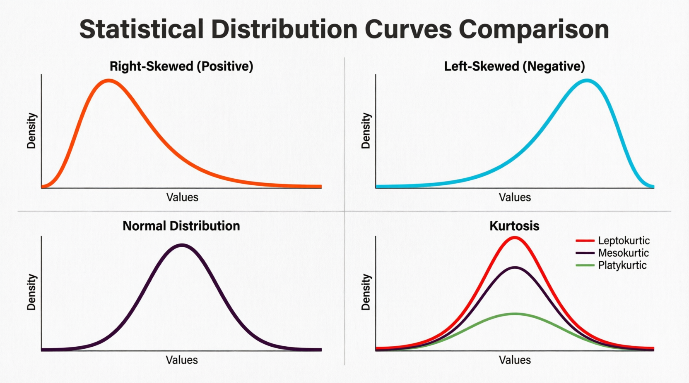

# Data Analytics - L1 Companion (Q&A)

Companion notes for questions arising while reading [DataAnalytics-L1.md](./DataAnalytics-L1.md).

## Q&A
[Q1: Why are there two "orthogonal cut" in the Data types note?](#orthogonal-cuts-in-the-note)
[Q2: For Interval vs Ratio, what does "true zero" actually mean? Does 0°C being "no true zero" mean it has no meaning? What does age=0 or weight=0 mean for Ratio?](#interval-vs-ratio)
[Q3: What is IQR? Formula? Why is it more robust than Range?](#iqr-vs-range)
[Q4: What are skewness, kurtosis, shapes and trends?](#skewness-kurtosis-shapes-and-trends)
---

### Orthogonal cuts in the note

"Orthogonal cut" = a classification axis that's independent of the main Categorical/Numerical split — it doesn't sit as a sub-branch of Nominal/Ordinal/Discrete/Continuous, but cuts across them from a different angle.

There are two because they're two separate, independent lenses:
1. **Interval vs Ratio** — whether the numeric scale has a true zero and equal spacing (applies within Numerical data: Celsius is Interval, weight is Ratio).
2. **Structured vs Semi-structured vs Unstructured** — how the data is organized/stored (tables vs JSON vs free text/images), regardless of whether values are categorical or numerical.

Both are orthogonal to the main Categorical/Numerical hierarchy — and orthogonal to each other too, since each answers a different question about the same dataset.
---

### Interval vs Ratio

True zero = zero represents the *total absence* of the quantity being measured.

- **Celsius (Interval):** 0°C isn't "no temperature" — it's just the freezing point of water, an arbitrary reference point. There's still thermal energy at 0°C, and negative values are meaningful (temperature can go below it). Because zero doesn't mean "none," ratios break: 20°C is not twice as hot as 10°C — convert to Fahrenheit (50°F vs 68°F) and the 2x ratio disappears. A real ratio would survive unit conversion; this doesn't, because the zero point is just a convention (different scales put zero in different places).
- **Age/Weight (Ratio):** age=0 means literally no time has elapsed since birth (absence of age); weight=0 means absence of mass. Negative age/weight isn't meaningful — unlike temperature. Because zero really means "none," ratios hold: 40 years old is truly twice 20 years old, and this stays true whether measured in years or days.

Practical test: **can you double the value and have "twice as much" mean something physically real, independent of the unit chosen?** Yes → Ratio. No (zero is arbitrary) → Interval.
---

### IQR vs Range
IQR (Interquartile Range) = spread of the middle 50% of the data.

Formula: **IQR = Q3 − Q1**
- Q1 (25th percentile) — value below which 25% of data falls
- Q3 (75th percentile) — value below which 75% of data falls

Robustness vs Range: Range = Max − Min, so it depends entirely on the two most extreme values — one outlier (data-entry error, a billionaire in an income dataset) can blow it up even if the rest of the data is tightly clustered. IQR ignores the top 25% and bottom 25% entirely, so outliers fall outside the Q1–Q3 window and don't affect it at all — only the "middle" of the data matters, which barely shifts even with a few extreme points.

Side note: this is also the basis for outlier detection — values below Q1 − 1.5×IQR or above Q3 + 1.5×IQR are commonly flagged as outliers (box-plot whiskers).
---

### Skewness, Kurtosis, Shapes, and Trends

**Skewness** — asymmetry of a distribution around its mean.
- Symmetric (≈0): mirrors both sides, Mean ≈ Median ≈ Mode (e.g., normal distribution).
- Right/Positive skew (>0): long tail to the right, a few large outliers pull Mean above Median (e.g., income, house prices).
- Left/Negative skew (<0): long tail to the left, Mean below Median (e.g., retirement age).

Formula: Skewness = E[(X − μ)³] / σ³ — cubing preserves the sign of deviations, so a few large deviations on one side dominate and pull the value in that direction.

**Kurtosis** — "tailedness"/peakedness relative to normal; how much data sits in the tails (extremes) vs the center.

Formula: Kurtosis = E[(X − μ)⁴] / σ⁴

- Mesokurtic (≈3, excess ≈0): normal-like tails.
- Leptokurtic (>3, excess >0): heavier tails, sharper peak, more extreme outliers than normal (e.g., stock returns — "fat tails").
- Platykurtic (<3, excess <0): thinner tails, flatter peak, fewer extreme outliers than normal.

"Excess kurtosis" = Kurtosis − 3 (centers normal at 0; what most software reports).

Why both matter: two datasets can share the same mean/std-dev but look totally different in shape — one symmetric/normal-tailed, another skewed with fat tails. Many statistical methods (t-tests, linear regression) assume normality, so high skew/kurtosis flags that assumption may not hold.

**Shape** — how a *single distribution's curve* is formed at one point in time: is it symmetric or lopsided (skewness), is it peaked with fat tails or flat with thin tails (kurtosis)? Shape describes a snapshot — feed it a batch of data (income, test scores, heights) and it tells you how that batch is distributed around its center. This is exactly the "Shape" bucket in the original note (`Shape — Skewness, Kurtosis`), and it's what the image above visualizes.

**Trend** — how a value *changes across an ordered sequence*, usually time (e.g., monthly revenue, daily active users, temperature over a year). A trend is directional: upward, downward, flat, cyclical/seasonal. Trend analysis lives in time-series analysis, not in the Shape category — a distribution's skewness doesn't tell you whether values are rising or falling over time, and a trending time series doesn't need to be skewed at all.

Why the distinction matters: skewness/kurtosis answer "what does the data look like right now, all together?" while trend answers "which way is the data moving as time (or sequence) progresses?" They're independent — a dataset can be highly skewed but flat over time, or symmetric (normal-shaped) but trending sharply upward. So "shape" and "trend" are two different lenses on data, not interchangeable terms — skewness/kurtosis are shape stats, not trend stats.

